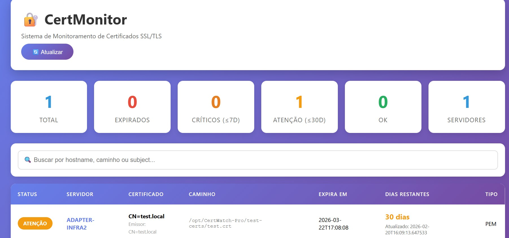

# 🔐 CertMonitor - Sistema de Monitoramento de Certificados

<div align="center">

**Sistema completo para monitorar certificados SSL/TLS em múltiplos servidores**

[](https://www.python.org/downloads/)
[](https://www.docker.com/)

[Início Rápido](#-início-rápido) • [Documentação](#-documentação) • [Exemplos](#-exemplos) • [FAQ](#-faq)

</div>

---

## Características

<table>
<tr>
<td width="50%">

### 🎨 Interface Moderna
- Dashboard responsivo
- Estatísticas em tempo real
- Busca e filtros
- Status visual por cores
- Auto-refresh

</td>
<td width="50%">

### 🔍 Monitoramento Completo
- Múltiplos servidores
- Formatos: .crt, .pem, .pfx, .cer, .p12
- Cálculo de dias restantes
- Alertas configuráveis
- API REST

</td>
</tr>
<tr>
<td width="50%">

### Fácil de Usar
- Setup em minutos
- Docker ready
- Agente leve (Python)
- Multi-plataforma
- Documentação completa

</td>
<td width="50%">

### Seguro
- Autenticação via token
- Não transfere arquivos
- Apenas metadados
- Open source
- Auditável

</td>
</tr>
</table>

---

## Início Rápido

###  3 Comandos para Começar

```bash
#  Inicie o servidor
docker-compose up -d

#  Configure e execute o agente
cd agent && pip install -r requirements.txt && python agent.py

#  Acesse a interface
# http://localhost:8000
```

###  Ou use o script automático:

**Windows:**
```cmd
start.bat
```

**Linux/Mac:**
```bash
chmod +x start.sh && ./start.sh
```

>  **Dica:** Leia [START_HERE.md](START_HERE.md) para um guia completo!

---

##  Preview

### Dashboard



```
┌─────────────────────────────────────────────────────────┐
│  🔐 CertMonitor                          [🔄 Atualizar] │
│  Sistema de Monitoramento de Certificados SSL/TLS      │
└─────────────────────────────────────────────────────────┘

┌────────┐ ┌────────┐ ┌────────┐ ┌────────┐ ┌────────┐
│   15   │ │   2    │ │   3    │ │   5    │ │   5    │
│ Total  │ │Expirado│ │Crítico │ │Atenção │ │   OK   │
└────────┘ └────────┘ └────────┘ └────────┘ └────────┘

┌─────────────────────────────────────────────────────────┐
│ Status │ Servidor │ Certificado │ Expira │ Dias       │
├────────┼──────────┼─────────────┼────────┼────────────┤
│ 🔴 EXP │ web-01   │ old.com     │ 2023.. │ -30 dias   │
│ 🟠 CRIT│ web-02   │ test.com    │ 2024.. │ 3 dias     │
│ 🟡 ATEN│ web-03   │ app.com     │ 2024.. │ 15 dias    │
│ 🟢 OK  │ web-04   │ site.com    │ 2025.. │ 180 dias   │
└────────┴──────────┴─────────────┴────────┴────────────┘
```

---

##  Arquitetura

```
┌─────────────────────────────────────────────────────────┐
│                    SERVIDOR CENTRAL                      │
│                      (Docker)                            │
│  ┌─────────────────────────────────────────────────┐   │
│  │  FastAPI + Interface Web + API REST             │   │
│  └─────────────────────────────────────────────────┘   │
│                    Porta: 8000                           │
└────────────────────────────┬────────────────────────────┘
                             │ HTTPS/API
                             │
        ┌────────────────────┼────────────────────┐
        │                    │                    │
┌───────▼────────┐  ┌───────▼────────┐  ┌───────▼────────┐
│  Agente 1      │  │  Agente 2      │  │  Agente N      │
│  (Cliente)     │  │  (Cliente)     │  │  (Cliente)     │
│                │  │                │  │                │
│ Certificados   │  │ Certificados   │  │ Certificados   │
│ .crt .pfx      │  │ .pem .cer      │  │ .crt .p12      │
└────────────────┘  └────────────────┘  └────────────────┘
```

---

##  Documentação

| Documento | Descrição |
|-----------|----------|
| [START_HERE.md](START_HERE.md) | **Comece aqui!** Guia  |
| [QUICKSTART.md](QUICKSTART.md) | Guia passo a passo completo |
| [ARCHITECTURE.md](ARCHITECTURE.md) | Documentação técnica |
| [PROJECT_STRUCTURE.md](PROJECT_STRUCTURE.md) | Estrutura do projeto |
| [DOCUMENTATION_INDEX.md](DOCUMENTATION_INDEX.md) | Índice completo |

---

##  Casos de Uso

- ✅ **Empresas** - Monitore todos os servidores centralizadamente
- ✅ **Provedores** - Gerencie certificados de clientes
- ✅ **DevOps** - Integre com CI/CD e automação
- ✅ **Segurança** - Auditoria e compliance

---

## Instalação Detalhada

### Servidor Central (Docker)

```bash
# 1. Clone/navegue até o diretório
cd Smallstep_Certificates

# 2. Configure o token de API (IMPORTANTE!)
# Edite docker-compose.yml:
# environment:
#   - API_TOKEN=seu-token-super-seguro

# 3. Inicie o servidor
docker-compose up -d

# 4. Verifique se está rodando
docker ps
curl http://localhost:8000/health

# 5. Acesse a interface
# http://localhost:8000
```

### Agente Cliente (Windows/Linux)

```bash
# 1. Copie a pasta agent/ para o servidor cliente

# 2. Configure agent/agent_config.yml:
server_url: http://seu-servidor:8000
api_token: seu-token-super-seguro
scan_paths:
  - C:\Certificates  # Windows
  # - /etc/ssl/certs  # Linux

# 3. Instale dependências
cd agent
pip install -r requirements.txt

# 4. Teste (executa uma vez)
python agent.py

# 5. Instale como serviço (opcional)
# Windows: execute install_windows.bat como Admin
# Linux: sudo bash install_linux.sh
```

---

##  Configuração

### Alertas e Notificações

Edite `config/config.yml`:

```yaml
alert_days: [30, 15, 7, 3, 1]

notifications:
  email:
    enabled: true
    smtp_server: smtp.gmail.com
    smtp_port: 587
    from: alerts@example.com
    to: admin@example.com
  
  webhook:
    enabled: true
    url: https://hooks.slack.com/services/YOUR/WEBHOOK
```

---

## Segurança

- ✅ Use HTTPS em produção (reverse proxy)
- ✅ Altere o API_TOKEN padrão
- ✅ Restrinja acesso por firewall
- ✅ Tokens fortes e únicos
- ✅ Logs de auditoria

---

## Exemplos

### Monitorar Servidor Windows
```yaml
# agent_config.yml
scan_paths:
  - C:\inetpub\ssl
  - C:\Certificates
  - D:\SSL
```

### Monitorar Servidor Linux
```yaml
# agent_config.yml
scan_paths:
  - /etc/ssl/certs
  - /etc/nginx/ssl
  - /var/www/ssl
```


---

## Troubleshooting

### Agente não conecta
```bash
# Verifique servidor
curl http://servidor:8000/health

# Verifique token
# Token deve ser idêntico no servidor e agente
```

### Certificados não aparecem
```bash
# Verifique permissões
# Verifique caminhos em scan_paths
# Execute: python agent.py (veja logs)
```

<div align="center">

**Nunca mais deixe um certificado expirar!**


</div>
